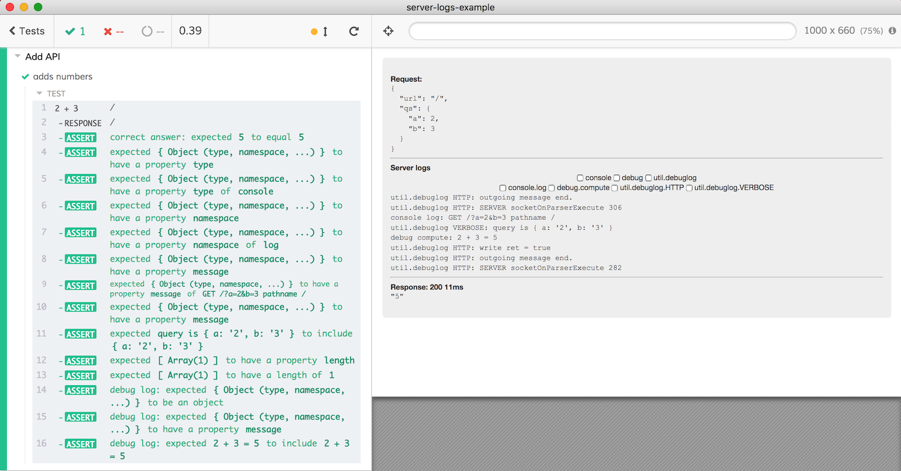

# server-logs-example [![renovate-app badge][renovate-badge]][renovate-app] [](https://circleci.com/gh/bahmutov/server-logs-example/tree/master)
> API testing using Cypress.io test runner with server-side logs

Shows how to use [@bahmutov/cy-api](https://github.com/bahmutov/cy-api) plugin and its custom `cy.api` command to perform end-to-end API testing with full server logs. See [cypress/integration/spec.js](cypress/integration/spec.js) file.

## Server

Server in [server/index.js](server/index.js) adds numbers passed as query parameters.

```shell
npm start
```

You can test it from from another terminal using curl or [httpie](https://httpie.org/)

```shell
$ http ':7000/?a=1&b=-10'
HTTP/1.1 200 OK
Connection: keep-alive
Date: Tue, 09 Jul 2019 01:37:13 GMT
Transfer-Encoding: chunked

-9
```

### Server logs

Every time we call `GET /`, the server logs the input arguments and has several types of verbose logging. See [server/index.js](server/index.js) for entire code, but the important lines are:

```js
// we will use console.log, util.debuglog and debug modules to log stuff
const verbose = require('util').debuglog('verbose')
const debug = require('debug')('compute')

// handle "GET /" request
const { pathname, query } = url.parse(req.url, true)
// let's just log the basic request parameters
console.log('%s %s pathname %s', req.method, req.url, pathname)
// and log the parsed query object in verbose mode
// visible when NODE_DEBUG=verbose is set
verbose('query is %o', query)
const a = parseFloat(query.a)
const b = parseFloat(query.b)
const sum = a + b
// "debug" log only shows the computation if DEBUG=compute is set
debug('%d + %d = %d', a, b, sum)
```

## End-to-end API tests



You can see request and response objects for each `cy.api` command and also see server-side logs, and even query into them by type and namespace. See [cypress/integration/spec.js](cypress/integration/spec.js) file, here is a part of the test:

```js
it('adds numbers', function () {
  // first argument - same as "cy.request" options
  // see https://on.cypress.io/request
  // second argument - optional name for this request
  cy.api(
    {
      url: '/',
      qs: {
        a: 2,
        b: 3
      }
    },
    '2 + 3'
  ).then(({ body, messages }) => {
    // you also have 'status', 'statusText',
    // 'requestHeaders', 'headers', and 'duration'
    // we can check the value returned by the API
    expect(body, 'correct answer').to.equal('5')
    // you can also inspect messages list and make assertions against it
    const utilLogs = filter(messages, { type: 'util.debuglog' })
    const queryLog = find(utilLogs, m => /query is/.test(m.message))
    expect(queryLog)
      .property('message')
      .to.include("{ a: '2', b: '3' }")
  })
})
```

## See

- Read ["Capture all the logs"](https://glebbahmutov.com/blog/capture-all-the-logs/)
- [@bahmutov/cy-api](https://github.com/bahmutov/cy-api) plugin provides `cy.api` command

[renovate-badge]: https://img.shields.io/badge/renovate-app-blue.svg
[renovate-app]: https://renovateapp.com/
